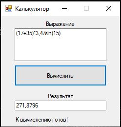

# Calculation

## Задача
На языке С++ или С# (на выбор, чем лучше владеете) написать
программу-калькулятор. В ней должно быть поле для ввода выражения
текстом. Текст автоматически должен распознаваться, среди него находить
числа и знаки математических действий. Сделать также кнопку "Вычислить",
при нажатии на которую автоматически вычислять и отображать результат.

Например: (17 + 35) * 3,4 / sin(15).

Вместо кнопки "Вычислить" можно сделать расчёт по кнопке Enter, либо
вообще считать на лету по мере ввода текста (на Ваше усмотрение).

Если есть знакомство с базами данных, то сделать также логирование
вычислений. То есть создать таблицу в БД и записывать в неё историю всех
вычислений на этом калькуляторе, а также дату этих вычислений.
